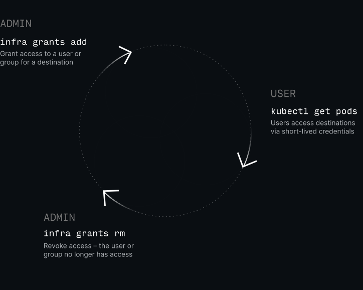
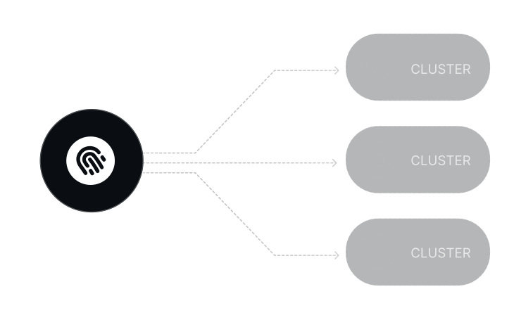
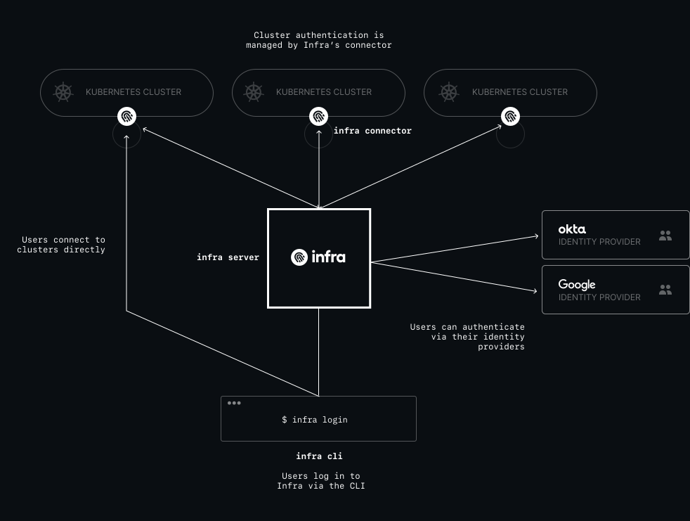

# What is Infra?

## Introduction

Infra is a tool for **managing access to infrastructure**.

Access is granted or revoked via Infra's CLI, API or configuration file, and in the background, Infra takes care of provisioning users & groups with the right permissions no matter where the cluster is hosted (AWS, Google Cloud, etc).

Users are automatically distributed short-lived credentials that expire after a short period of time.

For larger teams, Infra integrates with identity providers like Okta to automatically give access via existing user accounts or groups.



## Key Features

* Discover & access clusters via a single command `infra login`
* **No more out-of-sync** Kubeconfig files
* Support for native RBAC roles such as `view`, `edit` and `admin`
* **Onboard and offboard** users via an identity provider (e.g. Okta)
* Workflow for **dynamically requesting & granting access** to users (coming soon)
* **Audit logs** for who did what, when (coming soon)

## How it works

### Granting Access

At the core of Infra is it's

### Short-lived credentials

Infra creates and distributes **short-lived credentials** for users to connect to infrastructure.

### Connectors

**Connectors** are how Infra integrates with infrastructure.

### Architecture

## Use Cases

### Team cluster access

### Automatic onboarding & offboarding

### Just-in-time access

### Cloud-agnostic IAM

Infra works anywhere and doesn't depend on any existing identity & access management system such as AWS IAM, Google IAM or Azure AD. It can be completely self-hosted, including behind existing VPNs or proxies.

## What's next

Get up and running with the [Quickstart](./quickstart.md) guide or read about the [how Infra works](./how-infra-works.md).
