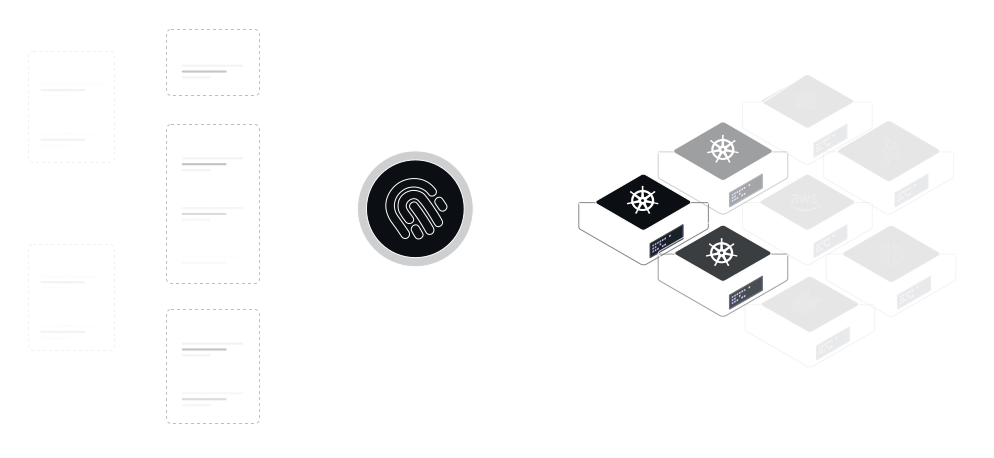

# What is Infra?

## Introduction



Infra is a tool for **managing access** to infrastructure. It connects any existing **user** or **group** to **any backend system** such as Kubernetes with the right level of access. It automates both **authentication** and **authorization** while remaining extensible to plug into existing tools in this space.

Infra is similar to Okta, Active Directory or Google Identity, except that it's designed ground-up for databases, APIs and compute clusters instead of web or mobile applications. Whereas Okta might help your team connect to your sales, HR or ticketing systems, Infra helps teams connect to Postgres, Kubernetes, SSH, AWS, admin tooling. This requires a fundemantally different approach that we've written more about in [how it works](#how-it-works).

Infra is [open source](https://github.com/infrahq/infra), and can be easily deployed on existing infrastructure in your own environment.



## Examples

### Logging In

Users start by logging in via their existing identity providers such as Okta. For smaller teams or machine users that don't exist in identity providers, Infra includes built-in username & password and access key login methods:

```
$ infra login
? Select a server:
  production.infrahq.com
> testing.infrahq.com
  development.infrahq.com
? Select an identity provider:
> okta (infra.okta.com)
  Login with username and password
  Login with an access key
  ...
  Logging in with okta...
  Logged in as suzie@infrahq.com
```

### Viewing access

Users list their access in a single command, including which level (i.e. permission or role) they have:

```
$ infra list
  NAME                         ACCESS
  production                   view
  production-delta             edit
  production-eu-1              admin
```

### Connecting to a cluster

Infra automatically **generates and distributes credentials** so there's no need to manually edit Kubeconfig files or similar configuration files. For Kubernetes, after running `infra login`, users' Kubeconfig and `kubectl` **just work**!

```
$ infra use production
Switched context to `production`

$ kubectl get pods
argocd          argocd-application-controller-7d7bdb9545-qg5q8            1/1     Running   0          63d
argocd          argocd-redis-5968fdb6cc-xzwtp                             1/1     Running   0          117d
argocd          argocd-repo-server-658f67f8c8-csffr                       1/1     Running   0          63d
argocd          argocd-server-5c77b68cb-xhbhs                             1/1     Running   0          117d
cert-manager    cert-manager-7645bbbcc9-gxm27                             1/1     Running   0          117d
cert-manager    cert-manager-cainjector-5bcf77b697-fj6s6                  1/1     Running   0          117d
...
```

### Granting & revoking access

Infra includes commands for granting and revoking access via a concept named [`grants`](#grants). When a grant is created, users or groups are **automatically provisioned access** to the right resources.

For example, to grant `view` access to a user (`suzie@infrahq.com` in this case), run:

```
$ infra grants add suzie@infrahq.com --role view production
Access granted
```

To grant a group named `Engineering` (e.g. from Okta) `admin` access to a cluster:

```
$ infra grants add -g Engineering --role admin development
Access granted
```

Once users no longer need access, access can be revoked:

```
$ infra grants remove -g Engineering --role edit development
Access revoked
```

Infra takes care of automatically revoking access in the destination cluster `development`.

### Inspecting all access

Admins can inspect access in a single place, for all users & groups across all destinations:

```
$ infra grants list
  USER (6)            ACCESS     DESTINATION
  jeff@infrahq.com    view       development-72f9584e
  mike@infrahq.com    edit       development-72f9584e.infrahq
  eva@infrahq.com     admin      digital_ocean_toronto

  GROUP (5)    ACCESS  DESTINATION
  Everyone     view    development-72f9584e
  Engineering  edit    development-72f9584e.infrahq
  Design       edit    development-72f9584e.web
  Everyone     admin   digital_ocean_toronto
```


## Use Cases

### Manage access as code

Infra allows teams to declare, in code, which users and groups from their team (e.g. in Okta) can access which infrastructure. For example, when deploying via [Kubernetes](./install/install-on-kubernetes.md), Infra can be provided a list of rules that can be enforced in code:

```yaml
# example values.yaml file
server:
  config:
    grants:
      # grant the Engineering group `admin` access to the `development` cluster
      - group: Engineering
        role: admin
        resource: development

      # grant the Oncall group `edit` access to the `production` cluster
      - group: Oncall
        role: edit
        resource: production

      # grant the Compliance group `view` access to the `development` cluster
      - group: Compliance
        role: view
        resource: development

    providers:
      # Allow above users and groups to access via an Okta account
      - name: okta
        url: acmecorp.okta.com
        clientID: 0oapn0qwiQPiMIyR35d6
        clientSecret: vU-baksdh19087j_s0sn7sjzxasj9aAS12SANjyKzl
```

### Automatic onboarding & offboarding

Infra includes deep integration with identity providers such as [Okta](../guides/identity-providers/okta.md). Users are automatically onboarded and provided access to the resources they need without having to create additional accounts or manage secrets.

If a user is removed from the identity provider, they automatically lose access to Infra and all resources. Unlike other tooling, Infra continously verifies users' information with upstream identity providers so access is revoked immediately after they are off-boarded.

### Fine-grained access

Most RBAC or access tooling is _coarse_ grained, meaning users usually receive **admin or nothing** access.

With Infra, users are granted access to specific resources inside a given infrastructure system. With Kubernetes and Infra you can:

* Map groups to namespaces (e.g. multi-tenant clusters where each team owns a namespace)
* Grant access to multiple namespaces together
* Give read access to a full cluster but write access to a specific namespace

As an example, to give access to a specific namespace via the Infra CLI:

```bash
# grant `edit` access for the Engineering group to
# the `web` namespace in the `production` cluster
$ infra grants add -g Engineering production.web --role edit
```

### Dynamic or just-in-time access

Since giving access can be done via a CLI command or REST API call with Infra, access can be provided on-the-fly for users who need it for a limited amount of time. This is sometimes called _dynamic_ access or _just-in-time_ access.

For example, if `suzie@infrahq.com` is starting their on-call schedule, they can be granted and revoked access automatically via an `infra` CLI command or API call:

```bash
# grant escalated production cluster access to suzie@infrahq.com
$ infra grants add suzie@infrahq.com production --role admin

# ...wait an hour, day or week...
$ sleep 3600

# revoke escalated production cluster access
$ infra grants remove suzie@infrahq.com production --role admin
```

### Portable access

Infra works on any major cloud provider and doesn't depend on any existing identity & access management system such as AWS, Google Cloud or Azure IAM. Supporting multiple cloud providers is a reality, especially for larger teams, and Infra provides a single API and model for managing users, groups and their access.

With Infra, teams can access infrastructure hosted on two different cloud providers. For example:

```
$ infra list
  NAME (4)                          ACCESS
  development-aws-us                admin
  development-aws-eu                edit
  production-azure                  view
```

## Next Steps

* Get up and running with the [Quickstart](./quickstart.md) guide
* [Install Infra](./install/install-on-kubernetes.md) on Kubernetes
* Read about the [how Infra works](../reference/how-infra-works.md)
