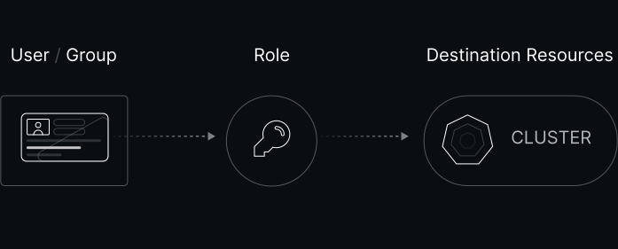
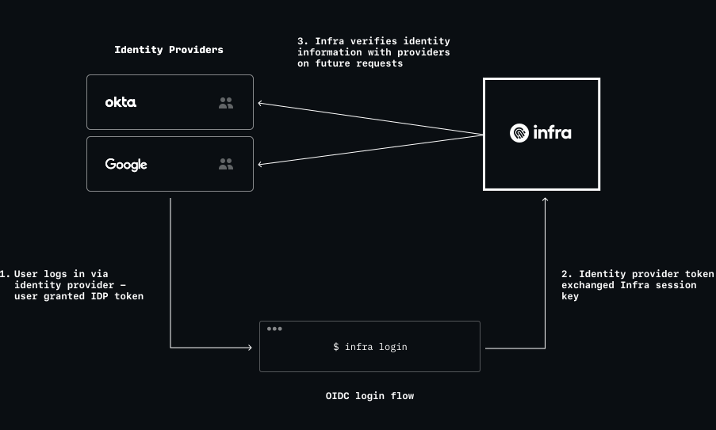
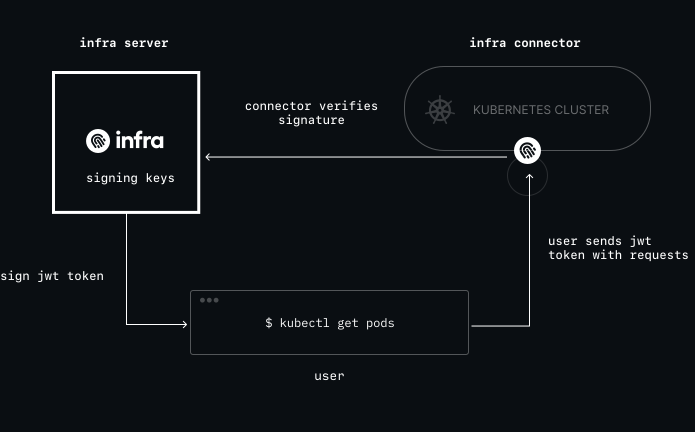

# How Infra works

## Architecture

### Infra server

The **Infra server** is a central API server that acts as the source of truth for users, groups, identity providers and access grants (more on these below). Its responsibilities include:

* Logging users in via their existing [identity providers](#identity-providers)
* Storing signing keys for generating short-lived [credentials](#credentials)
* Managing who can access what with what roles

### Infra CLI

The **Infra CLI** is a command-line tool for users to:
* Log in
* Discover infrastructure access
* Generate short-lived credentials to access infrastructure
* Automatically update local configuration files (e.g. Kubeconfig) with credentials for easy access

### Infra connector

The **Infra connector** is a lightweight process that runs on destination infrastructure. It:

* Configures the cluster RBAC against what is stored in the Infra server
* Intercepts and verifies requests from users directly (without routing or proxying requests through the Infra server)

## Access

Access is granted or revoked via Infra's CLI, API or configuration. Once granted, users can request short-lived credentials to connect to destination clusters.

When it comes time to revoke access (e.g. user is off-boarded, no longer on-call or simply no longer needs access), access is revoked in the same way.

### Grants

The unit of access is a **grant**, which combines three key records:

* User or Group
* Role
* Resource

Grants are **additive**, meaning that the existance of a grant can only increase a user's level of access but not subtract or take away access.

### Connectors

Connectors are lightweight processes that run on destination infrastructure and take care of authenticating users, and keeping the cluster RBAC configuration up to date with that users have defined in the Infra server.

### Identity Providers

### Credentials

In Infra, credentials use the JSON Web Token (JWT) format. Tokens are signed by a private root of trust managed by Infra's server, distributed to via the Infra CLI or API, and and verified by destination infrastructure at access time.

